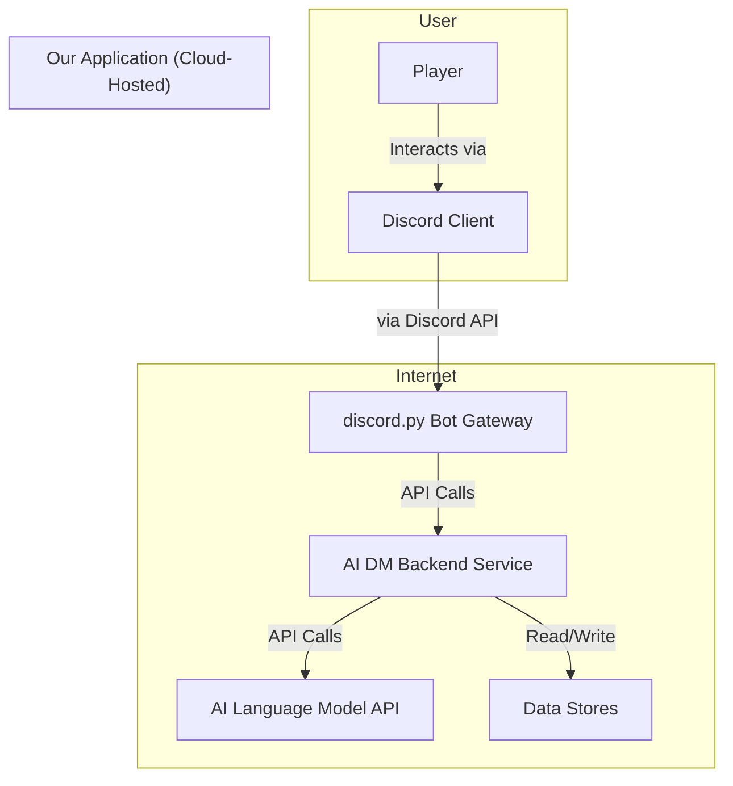

# Architecture & Key Strategies

## High Level System Flow

## Command Flow Architecture

**Standard Flow**: `/command` → Bot Gateway → API Call → Backend Service (ServerSettingsManager) → SQLite Table

## Key Architectural Strategies

### Error Handling
- **Centralized Handler**: All errors processed through unified error handling system
- **Custom Exceptions**: Use custom exception classes for specific error types
- **Traceable Logging**: Structured logging with full error context and traceability
- **Discord Error Decorator**: Use `@discord_error_handler()` decorator for all Discord commands

### Security & Data Validation
- **Secrets Management**: All secrets managed via environment variables (never hardcoded)
- **Input Validation**: All inputs validated by Pydantic models before processing
- **API Key Encryption**: Server API keys encrypted at rest using Fernet symmetric encryption

### Data Access Patterns
- **Abstraction Layers**: All data access MUST go through MemoryService
- **No Direct Database Calls**: Direct database calls from other components are forbidden
- **Database Auto-Migration**: Schema automatically created/updated on startup (no manual migrations)

### AI & State Management
- **Agentic AI with LangGraph**: Use LangGraph framework for complex AI tasks and state management
- **State Machine Pattern**: Core application built as explicit state machine/graph for deterministic control
- **Provider Pattern**: AI model and TTS service as swappable components for different providers

### Deployment & Containerization
- **Docker Compose**: Easy self-hosting using Docker Compose for local development
- **Containerization**: All services containerized for portability and consistent deployment
- **Cloud-Ready**: Designed for both self-hosting and cloud deployment

## Persistence Strategy (4-Tier)

1. **Structured World Data** (SQLite): Static SRD data (monster stats, spells) for fast lookups by RulesEngine
2. **Long-Term Campaign Memory** (YAML): Historical event log for each campaign (human-readable)
3. **Campaign Knowledge Base** (YAML): Evolving world data (NPCs, locations, party state)
4. **Live Session State** (JSON/Memory): Temporary data managed by LangGraph in-memory features

## Component Architecture

### Core Backend Components
- **ServerSettingsManager**: Discord server configuration management
- **CampaignManager**: Campaign creation, starting, and ending logic
- **PlayerManager**: Player and character management with campaign membership enforcement
- **CharacterManager**: Character CRUD operations with uniqueness constraints
- **AIOrchestrator**: Core component interfacing with LangGraph framework
- **CampaignMemoryService**: Manages all tiers of persistence strategy
- **RulesEngine**: Deterministic D&D 5.1 SRD rules via SQLite queries
- **NotificationService**: Sends responses in preferred format (text/voice)

### Bot Components (Cogs Pattern)
- **AdminCog**: Server administration (`/server-setup`, `/server-setkey`)
- **CampaignCog**: Campaign management (`/campaign new`, `/campaign join`)
- **CharacterCog**: Character management (`/character add`, `/character update`)
- **UtilityCog**: General utilities (`/help`, `/ping`, `/cost`)

## External API Dependencies

1. **AI Language Model Provider** (e.g., OpenAI): Core narrative and reasoning
2. **AI TTS Provider** (e.g., OpenAI): Text-to-speech functionality
3. **Discord API**: Foundational platform for bot interface

## Development Standards

### Code Quality Requirements
- **Type Hints**: ALL function signatures and variables must include full, correct type hints
- **PEP 8 Compliance**: Enforced via Black formatting and Ruff linting
- **Test Coverage**: High test coverage required for all new code before merge
- **Documentation**: All public APIs must have comprehensive docstrings

### Naming Conventions (Enforced)
- **snake_case**: Variables, functions, modules
- **PascalCase**: Classes
- **ALL_CAPS**: Constants
- **Descriptive Names**: Clear, self-documenting variable and function names

## Testing Strategy

### Test Organization
- **Unit Tests**: `tests/unit/` - Components in isolation with mocked dependencies
- **Integration Tests**: `tests/integration/` - Component interactions
- **E2E Tests**: `tests/e2e/` - Full user workflows
- **Test Utilities**: `tests/utils/` - Factories and test helpers

### Testing Requirements
- **Pytest Framework**: All tests use pytest with async support
- **High Coverage**: High test coverage required for all new code
- **CI Integration**: All tests run automatically on pull requests
- **Mock Dependencies**: External dependencies must be mocked in unit tests

## Deployment Architecture

### Development Environment
- **Docker Compose**: `docker-compose.yml` with bind mounts for hot reload
- **Live Reload**: FastAPI backend runs with `--reload` flag
- **Fast Feedback**: Instant code changes without rebuilds

### Production Environment
- **Immutable Images**: `docker-compose.prod.yml` with Dockerfiles
- **Self-Contained**: Source code copied into images at build time
- **CI/CD Ready**: GitHub Actions pipeline for automated deployment