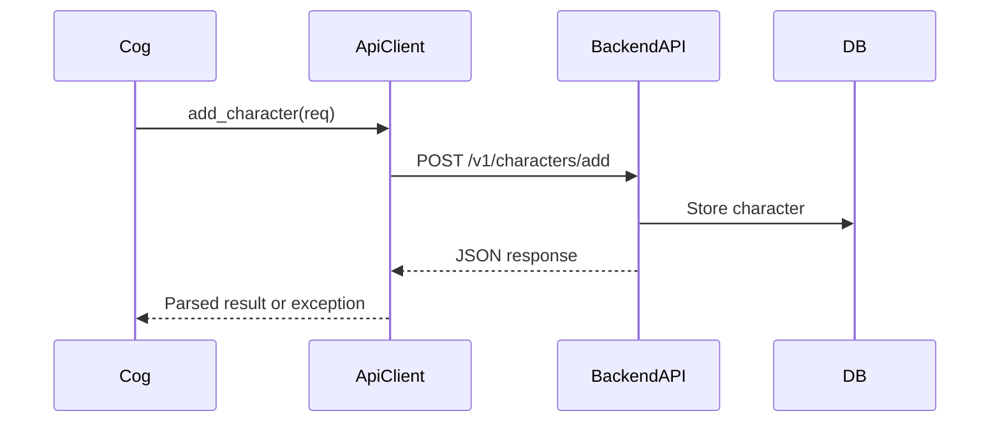

# Thin API Client Implementation Guide

> **Purpose:**  
> This guide provides a comprehensive, step-by-step approach to designing, implementing, and maintaining a "thin" API client for the project. It is intended for backend and bot developers integrating with the API layer, and for contributors extending or maintaining the client.

---

## Table of Contents

1. [What is a Thin API Client?](#what-is-a-thin-api-client)
2. [Architecture Overview](#architecture-overview)
3. [Key Benefits](#key-benefits)
4. [Implementation Roadmap](#implementation-roadmap)
5. [Detailed Steps & Code Examples](#detailed-steps--code-examples)
6. [Error Handling Strategy](#error-handling-strategy)
7. [Testing & Validation](#testing--validation)
8. [API Versioning Policy](#api-versioning-policy)
9. [Best Practices & Anti-Patterns](#best-practices--anti-patterns)
10. [Troubleshooting & FAQ](#troubleshooting--faq)
11. [Security Considerations](#security-considerations)
12. [Extending the Client](#extending-the-client)
13. [Implementation Checklist](#implementation-checklist)
14. [References & Further Reading](#references--further-reading)

---

## What is a Thin API Client?

A **thin API client** is a lightweight abstraction layer that encapsulates HTTP communication with a backend API. Its primary goals are to:
- Minimize boilerplate in business logic (e.g., cogs, managers)
- Centralize error handling and response parsing
- Provide a consistent, testable interface for all API interactions
- Enable future support for multiple backend APIs or versions

**Scope:**  
This client is not responsible for business logic, caching, or data transformation beyond request/response validation.

---

## Architecture Overview

**Flow Diagram:**



**Key Components:**
- **Cog:** Orchestrates user commands, delegates API calls to ApiClient
- **ApiClient:** Handles HTTP requests, error parsing, and response validation
- **BackendAPI:** FastAPI app exposing REST endpoints
- **DB:** Persistent storage

---

## Key Benefits

- **Reduces HTTP boilerplate** in cogs and managers
- **Centralizes error handling** and response validation
- **Improves testability** via mockable client interface
- **Enables multi-client support** (future extensibility)
- **Consistent API consumption** across the codebase

---

## Implementation Roadmap

1. **Refactor ApiClient** to use direct endpoint paths (no route indirection)
2. **Integrate ApiClient** into cogs (replace direct HTTP calls)
3. **Centralize error handling** in ApiClient
4. **Implement connection pooling** for performance
5. **Add API versioning support**
6. **Enhance test coverage** (unit, integration, error schema)
7. **Document and enforce best practices**

---

## Detailed Steps & Code Examples

### 1. Refactor ApiClient

**Location:** [`packages/shared/api_client.py`](packages/shared/api_client.py:1)

- Define methods for each endpoint (e.g., `add_character`, `update_character`)
- Use direct endpoint paths (e.g., `/v1/characters/add`)
- Example:

```python
class ApiClient:
    def __init__(self, base_url: str, timeout: float = 10.0):
        self.client = httpx.AsyncClient(
            base_url=base_url,
            timeout=timeout,
            limits=httpx.Limits(max_connections=10)
        )

    async def add_character(self, req: AddCharacterRequest) -> dict:
        url = f"{self.client.base_url}/characters/add"
        resp = await self.client.post(url, json=req.dict())
        return await self._handle_response(resp)

    # ... other methods ...
```

### 2. Integrate with Cogs

**Location:** [`packages/bot/cogs/character_cog.py`](packages/bot/cogs/character_cog.py:1)

- Replace direct HTTP calls with ApiClient methods
- Example:

```python
class CharacterCog:
    def __init__(self, bot):
        self.bot = bot
        self.api_client = ApiClient(base_url=os.getenv("FAST_API", "http://localhost:8000"))

    async def add_character(self, payload):
        try:
            response = await self.api_client.add_character(AddCharacterRequest(**payload))
            # handle response
        except CustomException as e:
            # handle error
```

### 3. Centralized Error Handling

- Implement a `_handle_response` method to parse backend errors and raise custom exceptions.
- Example:

```python
async def _handle_response(self, response):
    try:
        data = response.json()
    except Exception:
        data = {}
    if response.status_code == 200:
        return data
    error_info = data.get('error', {})
    error_code = error_info.get('code', 'UNKNOWN_ERROR')
    message = error_info.get('message', 'An unknown error occurred')
    details = error_info.get('details', {})
    # Map to custom exceptions
    if error_code == 'VALIDATION_ERROR':
        raise ValidationError(message, error_code, details)
    # ... other mappings ...
    raise CustomException(f"{response.status_code} Error: {message}", error_code, details)
```

### 4. Connection Pooling

- Use `httpx.AsyncClient` with connection limits for performance.
- Add a `close()` method to gracefully close the client.

### 5. API Versioning

- Support versioning in URL and headers.
- Document versioning policy (see [API Versioning Policy](#api-versioning-policy)).

---

## Error Handling Strategy

- **Structured Error Format:** All backend errors must follow a standard schema:
  ```json
  {
    "error": {
      "code": "VALIDATION_ERROR",
      "message": "Invalid input",
      "details": {...}
    }
  }
  ```
- **Custom Exceptions:** Map error codes to custom exception classes.
- **User-Friendly Messages:** Map technical errors to user-facing messages in cogs.

---

## Testing & Validation

- **Unit Tests:** Mock HTTP responses to test all ApiClient methods and error cases.
- **Integration Tests:** Validate end-to-end flows and error schema compliance.
- **Error Schema Validation:** Ensure all endpoints return errors in the expected format.
- **Mock Client:** Provide a mock ApiClient for use in cog tests.

---

## API Versioning Policy

- **Semantic Versioning:** MAJOR.MINOR.PATCH
- **Version in URL:** `/v1/characters/add`
- **Header Versioning:** `Accept: application/vnd.api.v1+json`
- **Lifecycle:** Active (6-12mo) → Deprecated (3mo) → Retired
- **Deprecation:** Use `Deprecation` header and update docs
- **See:** [`docs/architecture/api-specification.md`](docs/architecture/api-specification.md:1)

---

## Best Practices & Anti-Patterns

**Best Practices:**
- Always use ApiClient for API calls (no direct HTTP in cogs)
- Centralize error handling and response parsing
- Use Pydantic models for all requests/responses
- Write unit and integration tests for all endpoints

**Anti-Patterns:**
- Duplicating validation logic in cogs/managers
- Swallowing exceptions without logging
- Hardcoding endpoint URLs in multiple places

---

## Troubleshooting & FAQ

**Q: Why am I getting a 500 error from the API?**  
A: Check the backend logs for stack traces. Ensure the request payload matches the expected schema.

**Q: How do I add a new endpoint to the client?**  
A:  
1. Add a method to ApiClient.
2. Add request/response models if needed.
3. Write unit and integration tests.
4. Update documentation.

**Q: How do I mock the client in tests?**  
A: Use the provided `MockApiClient` in `tests/utils/mock_api_client.py`.

---

## Security Considerations

- Run `safety check -r requirements.txt` after dependency changes.
- Ensure error messages do not leak sensitive information.
- Validate all inputs using Pydantic models.

---

## Extending the Client

- Follow the existing method structure for new endpoints.
- Update the implementation checklist and documentation.
- Ensure new endpoints are covered by tests and error schema validation.

---

## Implementation Checklist

- [ ] Refactor ApiClient to use direct endpoint paths
- [ ] Integrate ApiClient into all cogs
- [ ] Centralize error handling in ApiClient
- [ ] Implement connection pooling
- [ ] Add API versioning support
- [ ] Write/expand unit and integration tests
- [ ] Validate error schema for all endpoints
- [ ] Add/maintain mock client for tests
- [ ] Run security scans
- [ ] Document all changes and update references

---

## References & Further Reading

- [API Specification](docs/architecture/api-specification.md)
- [Error Handling Epic](docs/error_epic.md)
- [Coding Standards](docs/architecture/coding-standards.md)
- [Testing Strategy](docs/architecture/testing-strategy.md)
- [Pydantic Documentation](https://docs.pydantic.dev/)
- [httpx Documentation](https://www.python-httpx.org/)

---