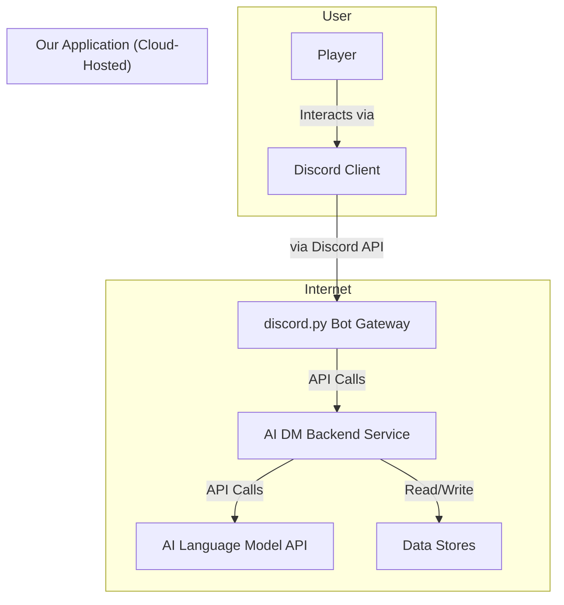

# AI D\&D DM Fullstack Architecture Document

## Introduction

This document outlines the complete fullstack architecture for the AI D\&D DM, including the Python backend systems, Discord bot integration, and all supporting services. It serves as the single source of truth for all technical implementation, ensuring a consistent, scalable, and secure application that can be effectively built by developer agents.

### Starter Template or Existing Project

The project will be built from scratch, but will adhere to established best practices and patterns from modern tools.

* **Backend Service:** The structure will follow the patterns of the **FastAPI** framework for a clean, service-oriented design.
* **Discord Bot:** The code will be organized using the **Cogs** pattern, which is the best practice for the `discord.py` library.

### Change Log

| Date       | Version | Description                               | Author
| :---       | :---    | :---                                           | :---               |
| 2025-07-25 | 1.0     | Initial draft of all sections of the architecture | Winston, Architect |

## High Level Architecture

### Technical Summary

This project is architected as a cloud-hosted, service-oriented application with a Python backend and a Discord bot interface. The backend, structured using FastAPI patterns, will house the core AI logic, leveraging agentic frameworks like CrewAI to manage the complex tasks of a Dungeon Master. The `discord.py` bot interface will be organized using the Cogs pattern for scalability and clarity. To ensure flexibility, the system will employ a polyglot persistence strategy, using the best storage solution for each type of data, from campaign files to session memory. This design prioritizes a clean separation of concerns between the bot interface and the AI core, creating a robust foundation for the immersive, conversational experience outlined in the PRD.

### Architectural Overview

* **Architectural Style:** For the MVP, we will build a **Modular Monolith**. This means the entire backend will be a single, deployable application, but it will be designed internally with a clear, service-oriented separation of concerns.
* **Repository Structure:** We will use a **Monorepo** to contain the Python backend service, the `discord.py` bot code, and any shared libraries, simplifying dependency management.
* **Platform:** The application will be a **Cloud-Hosted Service**, designed for portability via Docker.

### High Level Project Diagram

This diagram illustrates the main components of the system and their interactions.



### Architectural and Design Patterns

   * **Modular Monolith:** Provides a balance of simplicity for the MVP with a clear path for future scaling.
   * **Cogs Pattern (for Discord Bot):** A proven pattern for organizing bot commands into logical modules.
   * **Agentic AI:** Using frameworks like CrewAI to manage complex AI tasks and state.
   * **Polyglot Persistence:** Using the best tool for each data job (files, key-value stores, etc.).
   * **Containerization:** The application's services will be containerized (using Docker) to ensure portability and simplify both local self-hosting and cloud deployment.
   * **Provider Pattern for AI:** The AI model and TTS service will be treated as "swappable" components, allowing the system to be configured to use different providers.

## Tech Stack

| Category | Technology | Version | Purpose | Rationale |
| :--- | :--- | :--- | :--- | :--- |
| **Backend Language** | Python | 3.11 | Primary language for all backend logic. | Modern, robust, and has an extensive ecosystem for AI and web services. |
| **Backend Framework**| FastAPI | 0.111.0 | Provides the structure for our backend service. | High performance, excellent for building APIs, and has automatic documentation. |
| **AI Framework** | CrewAI | 0.35.8 | Manages the collaborative AI agents (DM, NPCs, etc.). | A powerful agentic framework that simplifies building sophisticated AI systems. |
| **Bot Interface** | discord.py | 2.3.2 | Connects our application to the Discord API. | The leading and most robust library for creating Discord bots in Python. |
| **Data Persistence** | Polyglot | N/A | Flexible data storage. | Uses the best tool for each job: SQLite for simple local data, and YAML/JSON for campaign files. |
| **Containerization** | Docker / Docker Compose | Latest | Packages the application for portability. | Simplifies local self-hosting and ensures consistent deployment environments. |
| **Testing Framework**| Pytest | 8.2.2 | For all unit and integration tests. | The standard for Python testing; powerful, flexible, and has a rich plugin ecosystem. |


## Data Models


The following Pydantic models define the core data structures for the application.


```python
from pydantic import BaseModel, SecretStr
from typing import List, Optional, Literal

class Server(BaseModel):
    server\_id: str
    api\_key: SecretStr
    dm\_roll\_visibility: Literal\['public', 'hidden']
    player\_roll\_mode: Literal\['manual\_physical\_total', 'manual\_physical\_raw', 'manual\_digital', 'auto\_visible', 'auto\_hidden']
    character\_sheet\_mode: Literal\['digital\_sheet', 'physical\_sheet']

class Campaign(BaseModel):
    campaign\_id: str
    server\_id: str
    name: str
    active\_player\_ids: List\[str]

class PlayerCharacter(BaseModel):
    character\_id: str
    player\_discord\_id: str
    campaign\_id: str
    name: str
    character\_sheet\_url: Optional\[str] = None
    preferred\_output\_mode: Literal\['text', 'voice'] = 'text'
```

## Persistence Strategy

The application uses a four-tiered persistence strategy for different types of data:

1. **Structured World Data (The "Rules Library"):** Static SRD data (monster stats, spells) will be pre-loaded into the **SQLite database** for fast, reliable lookups by the `RulesEngine`.
2. **Long-Term Campaign Memory (The "Campaign Chronicle"):** The historical event log for each campaign will be stored in a **YAML file**, providing a human-readable record.
3. **Campaign Knowledge Base (The "Living Lore"):** Evolving, persistent world data (NPC traits, location details, party state) will be stored in a set of **YAML files** (`npcs.yaml`, `locations.yaml`, `player\_characters.yaml`, `party\_state.yaml`).
4. **Live Session/Encounter State (The "Scratchpad"):** Temporary, in-the-moment data (conversational context, combat tracker) will be managed by the **CrewAI framework's in-memory features** and temporary **JSON files**.

## API Specification

The communication between the Bot and Backend is defined by the following OpenAPI 3.0 contract.

```yaml
openapi: 3.0.1
info:
  title: AI DM Backend API
  version: 1.0.0
  description: API for managing campaigns, settings, and interacting with the AI Dungeon Master.
servers:
  - url: /api/v1
paths:
  /servers/{server\_id}/config:
    put:
      summary: Create or Update Server Configuration
      description: Sets the server-wide API key and play style settings.
  /campaigns:
    post:
      summary: Create a new campaign
  /campaigns/{campaign\_id}/join:
    post:
      summary: Join an existing campaign
  /campaigns/{campaign\_id}/action:
    post:
      summary: Submit a player action
  /characters/{character\_id}:
    get:
      summary: Get Character Information
```

## Components

The backend service is broken down into the following logical components:

* **`ServerSettingsManager`:** Manages the configuration for each Discord server.
* **`CampaignManager`:** Handles logic for creating, starting, and ending campaigns.
* **`PlayerManager`:** Manages players joining a campaign and their characters.
* **`AIOrchestrator`:** The core component that interacts with the CrewAI framework.
* **`MemoryService`:** Manages all tiers of the persistence strategy.
* **`RulesEngine`:** Provides deterministic results for D\\\&D 5.1 SRD rules by querying the SQLite database.
* **`NotificationService`:** Sends responses to players in their preferred format (text or voice).

## External APIs

The application depends on the following external services:

1. **AI Language Model Provider (e.g., OpenAI):** Powers the core narrative and reasoning. Accessed via the user-provided key.
2. **AI TTS Provider (e.g., OpenAI):** Powers text-to-speech. Accessed via the user-provided key. A notification during setup is required to inform the user of this cost.
3. **Discord API:** The foundational platform for the bot interface.

## Core Workflows

The components interact in a clear sequence to handle user actions, as illustrated in the Player Action Workflow diagram. The primary risks in this workflow are latency from external APIs and the potential for low-quality AI responses, which are mitigated by robust error handling and a strong separation between deterministic rules and creative narration.

## Database Schema

The SQLite database will contain the "Rules Library" of static SRD data.

```sql
CREATE TABLE Monsters (
    monster\_name TEXT PRIMARY KEY,
    armor\_class INTEGER NOT NULL,
    hit\_points TEXT NOT NULL,
    actions TEXT
);

CREATE TABLE Spells (
    spell\_name TEXT PRIMARY KEY,
    level INTEGER NOT NULL,
    description TEXT NOT NULL
);

-- Server and PlayerCharacters tables will also be in the SQLite DB
-- for structured, relational data.
```

## Source Tree

The project will use a monorepo structure that separates the reusable campaign modules from the dynamic campaign saves.

```plaintext
/ai-dm-project/
├── data/
│   ├── modules/
│   │   └── [module_name]/
│   │       └── lore/
│   ├── saves/
│   │   └── [campaign_save_id]/
│   │       ├── chronicle.yaml
│   │       ├── parties/
│   │       │   └── [party_name]/
│   │       └── player_characters.yaml
│   └── srd_database.sqlite
├── packages/
│   ├── bot/
│   ├── backend/
│   └── shared/
└── docs/
```

## Infrastructure and Deployment

The project is designed for easy self-hosting using **Docker Compose**. A `docker-compose.yml` file will define and link the necessary services. A future cloud-hosted version will use a standard CI/CD pipeline (e.g., GitHub Actions) to deploy containers.

## Key Strategies

* **Error Handling:** A centralized handler, custom exceptions, and traceable logging will be used.
* **Coding Standards:** **Black** for formatting and **Ruff** for linting will be enforced. All code must adhere to the PEP 8 style guide.
* **Test Strategy:** **Pytest** will be used for both unit and integration tests.
* **Security:** Secrets will be managed via environment variables, and all inputs will be validated by Pydantic models.
* **Type Hints:** All function signatures and variable declarations must include full, correct type hints. This is critical for both code clarity and for the AI agents' understanding.
* **Naming Conventions:** snake_case for variables, functions, and modules. PascalCase for classes. Constants should be in ALL_CAPS.
* **Use the Abstraction Layers:** All data access must go through the MemoryService. Direct database calls from other components are forbidden.

## Observability

To ensure long-term maintainability and assist in debugging the AI's behavior, the architecture will include:

* **LLM Observability:** Integration with a tracing platform (e.g., LangSmith, LangFuse) to provide detailed, step-by-step traces of the AI's "thought process." This is a foundational task for Epic 1.
* **Campaign Transcript:** A `transcript.log` will be maintained for each campaign, providing a complete, raw record of all player and AI messages for debugging and future summarization features.