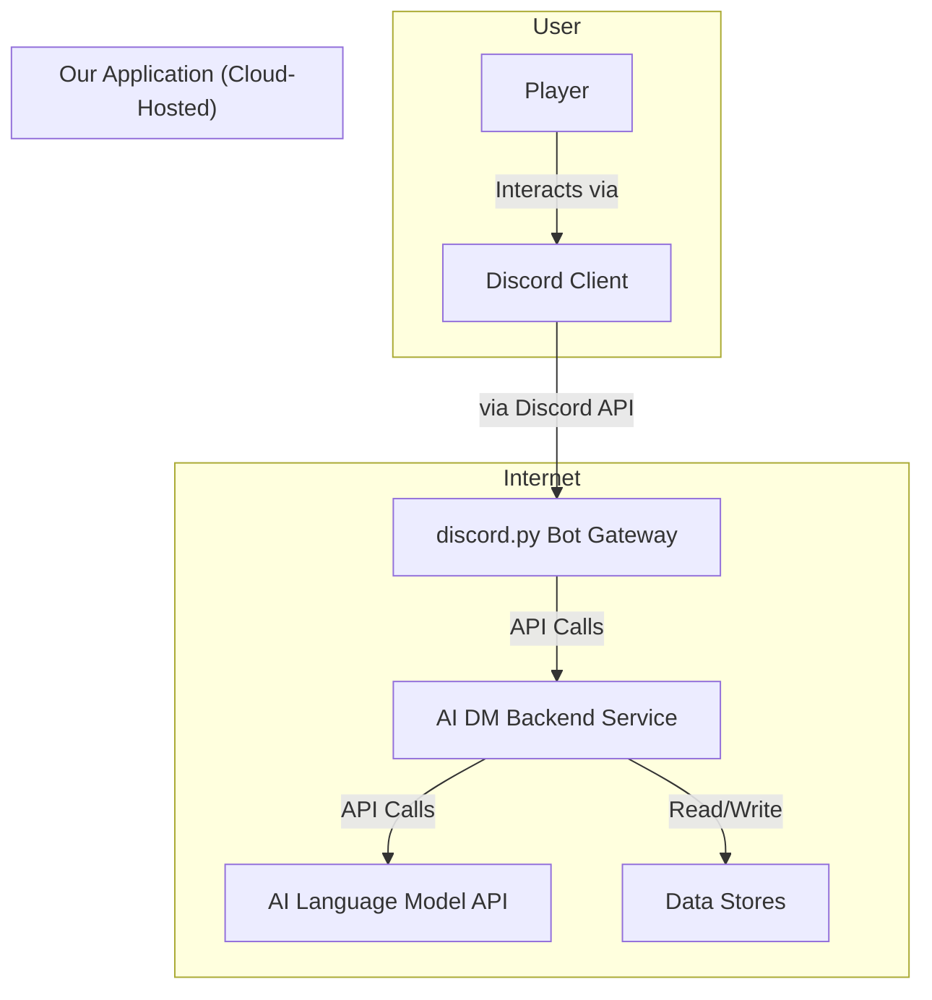

# High Level Architecture

### Technical Summary

This project is architected as a cloud-hosted, service-oriented application with a Python backend and a Discord bot interface. The backend, structured using FastAPI patterns, will house the core AI logic, leveraging agentic frameworks like CrewAI to manage the complex tasks of a Dungeon Master. The `discord.py` bot interface will be organized using the Cogs pattern for scalability and clarity. To ensure flexibility, the system will employ a polyglot persistence strategy, using the best storage solution for each type of data, from campaign files to session memory. This design prioritizes a clean separation of concerns between the bot interface and the AI core, creating a robust foundation for the immersive, conversational experience outlined in the PRD.

### Architectural Overview

* **Architectural Style:** For the MVP, we will build a **Modular Monolith**. This means the entire backend will be a single, deployable application, but it will be designed internally with a clear, service-oriented separation of concerns.
* **Repository Structure:** We will use a **Monorepo** to contain the Python backend service, the `discord.py` bot code, and any shared libraries, simplifying dependency management.
* **Platform:** The application will be a **Cloud-Hosted Service**, designed for portability via Docker.

### High Level Project Diagram

This diagram illustrates the main components of the system and their interactions.

### Architectural and Design Patterns

   * **Modular Monolith:** Provides a balance of simplicity for the MVP with a clear path for future scaling.
   * **Cogs Pattern (for Discord Bot):** A proven pattern for organizing bot commands into logical modules.
   * **Agentic AI:** Using frameworks like CrewAI to manage complex AI tasks and state.
   * **Polyglot Persistence:** Using the best tool for each data job (files, key-value stores, etc.).
   * **Containerization:** The application's services will be containerized (using Docker) to ensure portability and simplify both local self-hosting and cloud deployment.
   * **Provider Pattern for AI:** The AI model and TTS service will be treated as "swappable" components, allowing the system to be configured to use different providers.

