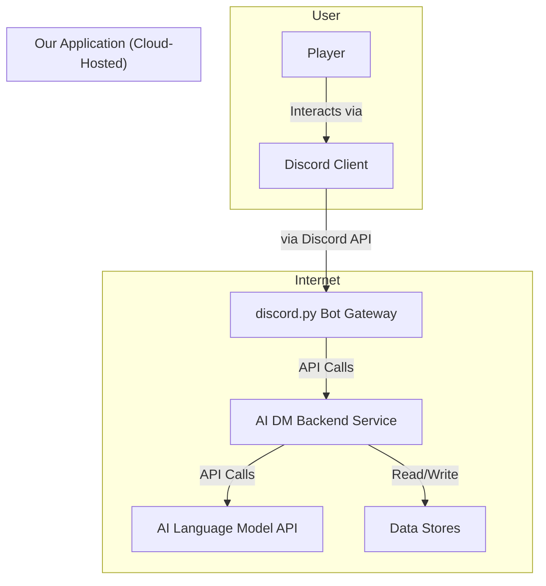

# Key Strategies

* **Error Handling:** A centralized handler, custom exceptions, and traceable logging will be used.
* **Coding Standards:** **Black** for formatting and **Ruff** for linting will be enforced. All code must adhere to the PEP 8 style guide.
* **Test Strategy:** **Pytest** will be used for both unit and integration tests.
* **Security:** Secrets will be managed via environment variables, and all inputs will be validated by Pydantic models.
* **Type Hints:** All function signatures and variable declarations must include full, correct type hints. This is critical for both code clarity and for the AI agents' understanding.
* **Naming Conventions:** snake_case for variables, functions, and modules. PascalCase for classes. Constants should be in ALL_CAPS.
* **Use the Abstraction Layers:** All data access must go through the MemoryService. Direct database calls from other components are forbidden.
* **Discord Bot Commands** should use tree in order to be visible inside server. Example: ```@tree.command(name="{command}", description="{command_description}")```
* **Backend Service:** The structure will follow the patterns of the **FastAPI** framework for a clean, service-oriented design.
* **Discord Bot:** The code will be organized using the **Cogs** pattern, which is the best practice for the `discord.py` library.
* **Command flow** will use the flow: /command -> Bot Gateway -> API Call -> Backend Service (containing the ServerSettingsManager) -> SQLite Table
* **Deployment** The project must support easy self-hosting using **Docker Compose** and will be updated as the project grows.
* **Agentic AI:** Using frameworks like LangGraph to manage complex AI tasks and state.
* **Agentic AI (State Machine):** By using **LangGraph**, we will build the core application as a state machine or graph. This gives us explicit, deterministic control over the game loop, which is essential for a rule-heavy, stateful application.
* **Polyglot Persistence:** Using the best tool for each data job (files, key-value stores, databases, etc.).
* **Containerization:** The application's services will be containerized (using Docker) to ensure portability and simplify both local self-hosting and cloud deployment.
* **Provider Pattern for AI:** The AI model and TTS service will be treated as "swappable" components, allowing the system to be configured to use different providers.


### High Level Project Diagram

This diagram illustrates the main components of the system and their interactions.

