```mermaid
sequenceDiagram
    participant User
    participant Bot

    User->>Bot: /ingest list
    Bot-->>User: (Displays an embed) "Here are your current custom content sources:\n- `my_monsters.txt` (Status: Completed)\n- `dndbeyond.com/spells/fireball` (Status: Completed)\n- `epic_items.pdf` (Status: Pending Review)"
    
    User->>Bot: /ingest review epic_items.pdf
    Bot-->>User: (Displays the assets extracted from that file) "Reviewing `epic_items.pdf`:\n\n**Asset 1: Sword of a Thousand Truths**\n*Weapon (longsword), legendary*\n\nDo you want to [Approve] or [Reject] this item?"
    
    User-->>Bot: (Clicks "Approve")
    Bot-->>User: "✅ 'Sword of a Thousand Truths' has been approved and added to your campaign's lore."
```

# **AI D&D DM UI/UX Specification - Phase 2**

## **Introduction**

This document defines the user experience goals, information architecture, user flows, and interaction design specifications for the "Grand Vision" phase of the AI D&D DM project. It builds upon the successful MVP, expanding the platform's capabilities to include a full TTRPG Creative Suite and advanced, immersive gameplay features.

### **Overall UX Goals & Principles**

#### **Target User Personas**
The design for this phase will cater to three distinct user segments:
* **The Hobbyist & Contributor:** Our core community who desires ultimate creative control and flexibility.
* **The Human Dungeon Master:** A new primary user who needs powerful, intuitive tools to streamline their creative process and manage their games.
* **The Convenience Player:** An expansion audience who values a polished, hassle-free, and immersive entertainment experience.

#### **Usability Goals**
* **Empower Creativity:** The "Creative Suite" should feel like an intuitive and powerful partner, enabling DMs to create, manage, and share their homebrew content with ease.
* **Seamless Immersion:** The new multimedia features (voice, images, music) should blend seamlessly into the narrative, enhancing the story without feeling intrusive.
* **Frictionless Collaboration:** The new party and campaign management tools should make it effortless for groups to organize and play their games.

#### **Design Principles**
1.  **DM-Centric Design:** For the Creative Suite, every design decision must be made with the goal of reducing the human DM's workload and enhancing their creative power.
2.  **Clarity Above All:** The interface for both gameplay and creation must be clear, concise, and unambiguous.
3.  **Immersive, Not Intrusive:** The "UI" is the story. All new features, especially multimedia, must serve to enhance the narrative, not interrupt it.
4.  **Consistency Across Platforms:** The "classic fantasy sourcebook" brand identity must be consistently applied across the Discord bot and the new Campaign Wiki.

### **Change Log**

| Date       | Version | Description                               | Author           |
| :---       | :---    | :---                                      | :---             |
| 2025-08-03 | 1.0     | Initial draft based on Phase 2 Brief      | Sally, UX Expert |

-----

## **Information Architecture (IA)**

### **Command & State Inventory**

This diagram shows the expanded command inventory, including the new "Creative Suite" and "Virtual Tabletop" commands.


---

### **Navigation Structure**

  * **Primary Navigation:** The primary method of navigation will continue to be Discord's native slash command (`/`) interface. The command list will now be organized into logical groups (e.g., `campaign`, `party`, `homebrew`) for easier discoverability.
  * **The Creative Hub (`/homebrew` & `/ingest`):** These two command groups will serve as the primary entry points into the new TTRPG Creative Suite.
  * **The Information Hub (`/wiki`):** The `/wiki` commands will be the gateway to the new, user-friendly web interface for campaign lore.
  * **Contextual Gameplay:** Within the "Role-playing State," interaction remains primarily conversational, now enhanced with new in-game commands like `/map` and `/journal` that provide information without breaking the narrative flow.

-----

## **User Flows**

### **Flow: Managing a Campaign Party**

**User Goal:** As a campaign host, to have complete control over forming a party, whether it's a private, invite-only group or a public group looking for new members.

**Entry Points:** `/party create`, `/party invite @player`, `/party join [invite-name]`, `/party recruiting [on|off]`

**Success Criteria:** A host can successfully create and manage a party, and players can join seamlessly through either a direct invite or a public recruitment name.

#### **Flow Diagram: Private, Invite-Only Party**

```mermaid
sequenceDiagram
    participant Host as Campaign Host
    participant Player2 as Player 2
    participant Bot

    Host->>Bot: /party create
    Bot-->>Host: "A new private party has been created. Use '/party invite @player' to add members."
    
    Host->>Bot: /party invite @Player2
    Bot-->>Player2: (Sends a Direct Message) "You have been invited to join [Host]'s party for the '[Campaign Name]' campaign! Would you like to [Accept] or [Decline]?"
    
    Player2-->>Bot: (Clicks Accept)
    Bot-->>Host: "✅ [Player2] has accepted your invitation and joined the party!"
    Bot-->>Player2: "Welcome to the party! Please link your character sheet or let me know you're using a physical one."
```



#### **Flow Diagram: Public, Recruiting Party**

```mermaid
sequenceDiagram
    participant Host as Campaign Host
    participant Player3 as Player 3
    participant Bot

    Host->>Bot: /party recruiting on
    Bot-->>Host: "Recruiting is now ON. The public invite name is: 'blue-dragon-7'. Players can now join using '/party join blue-dragon-7'."
    
    Player3->>Bot: /party join blue-dragon-7
    Bot-->>Player3: "Welcome to the party! Please link your character sheet or let me know you're using a physical one."
    Player3->>Bot: "[link to player3's character sheet]"
    Bot-->>Host: "✅ [Player3] has joined the party via the public invite!"
    Bot-->>Player3: "Got it. Welcome aboard, [Player3's Character Name]!"
```



---

### **Edge Cases for Party Management**

**Invite & Join Logic:**

* **Expired Invites:** What happens if a player tries to accept an invite to a party that has since been deleted by the host?
* **Duplicate Invites:** What happens if a host tries to invite a player who is already in the party?
* **Joining an In-Progress Session:** What happens if a player joins a party while the rest of the group is in the middle of a combat encounter or an important narrative moment? Does the bot pause the game and announce their arrival, or do they join quietly and wait for a natural entry point?
* **Player in Multiple Parties:** Can a single player character be a member of multiple parties on the same server, or are they locked to one at a time? This has implications for the "Persistent World" model.

**State & Permission Conflicts:**

* **Host Leaves:** What happens if the host of a party leaves the Discord server or deletes their account? Is there a mechanism to transfer ownership of the party to another member?
* **Kicking a Player:** We haven't defined a `/party kick @player` command. This is a necessary, if unfortunate, tool for a party host to have. We need to define how that works.
* **Changing Settings Mid-Session:** What happens if the host changes a fundamental setting (like the "Player Roll Mode") in the middle of a session? How and when is that change communicated to the players?
* **Recruiting Toggle Spam:** What prevents a host from rapidly turning the `/party recruiting` command on and off, potentially spamming a future "looking for group" channel?

-----

### **Flow: Creating Homebrew Content**

**User Goal:** As a Dungeon Master, to be guided through a best-practice process for creating a new, balanced homebrew monster, with AI assistance for both creative ideas and rules balancing.

**Entry Points:** `/homebrew create monster`

**Success Criteria:** A user can successfully follow the guided prompts to create a complete, well-structured, and balanced monster, and have it saved to their campaign's lore files, ready for use.

#### **Flow Diagram**

```mermaid
sequenceDiagram
    participant User
    participant Bot
    participant AI_Balance_Agent as AI Balance Agent

    User->>Bot: /homebrew create monster
    Bot-->>User: "Great! Let's create a new monster. First, what is the core concept or idea for this creature? (e.g., 'a small, fiery lizard that explodes when it dies')"
    
    User->>Bot: "A goblin shaman who uses wild, unpredictable magic."
    Bot-->>User: "Excellent concept! Now, let's set the basic stats. What is its intended Challenge Rating (CR)?"
    
    User->>Bot: "CR 2"
    Bot-->>User: (Presents an interactive form/modal with suggested stats for a CR 2 creature) "Here are some baseline stats for a CR 2 creature. Feel free to adjust them."
    
    User-->>Bot: (Fills out and submits the stats)
    Bot-->>User: "Stats saved. Now for the fun part: Actions. Let's add its primary attack. What does it do?"

    User->>Bot: "It has a staff that does 1d6 bludgeoning damage and on a hit, the target has to make a Wisdom save or be affected by a random wild magic effect."
    Bot->>AI_Balance_Agent: (Sends the action description for analysis)
    AI_Balance_Agent-->>Bot: (Returns feedback) "Analysis: This is a great idea! A DC 13 Wisdom save would be appropriate for a CR 2 creature. The damage is a bit low; consider increasing it to 1d8+2 to make it more of a threat."

    Bot-->>User: "AI Suggestion: That's a great ability! For a CR 2 creature, a DC 13 Wisdom save would be well-balanced. The damage is a little low; you might consider increasing it to 1d8+2. Would you like to [Use Suggestion] or [Keep Original]?"

    User-->>Bot: (Clicks "Use Suggestion")
    Bot-->>User: "Updated! The monster has been created and saved to your campaign's lore. You can review it in your Campaign Wiki."
```

-----

### **Flow: Manual Homebrew Creation**

**User Goal:** As an experienced Dungeon Master, to quickly and efficiently create a new homebrew monster by manually filling in a structured template, with the ability to add my own custom fields.

**Entry Points:** `/homebrew create monster --manual` (or a similar flag/option)

**Success Criteria:** A user can successfully create a complete monster by manually providing all the necessary stats, have it saved to their campaign's lore files, and be confident that the system has not altered any of their inputs.

#### **Flow Diagram**


-----

### **Flow: Ingesting Content from a URL**

**User Goal:** As a Dungeon Master, to quickly import a monster or spell I've found on a community platform like D\&D Beyond directly into my campaign's lore files without manual data entry.

**Entry Points:** `/ingest from-url [url]`

**Success Criteria:** A user can provide a valid URL to a supported platform, and the system will automatically parse the content, structure it, and add it to their campaign's Knowledge Base, ready for review.

#### **Flow Diagram**


**Edge Cases & Error Handling:**

  * **Unsupported URL:** If the user provides a URL from a site that is not supported, the bot will respond: "Sorry, I can only ingest content from the following supported platforms: [list of platforms]."
  * **Parsing Failure:** If the backend cannot successfully parse the content from a valid URL (e.g., due to a change in the website's layout), the bot will respond: "I had trouble reading the content from that URL. The site's structure may have changed. You can try uploading the content from a file instead using `/ingest upload`."

-----

### **Flow: Ingesting Content from a File Upload**

**User Goal:** As a Dungeon Master, to upload a file containing my own lore or rules, and have the AI intelligently parse it and prepare it for my campaign without me having to re-type everything.

**Entry Points:** `/ingest upload`

**Success Criteria:** A user can upload a supported file, have the AI successfully identify and structure game assets from the text, and then be able to review and approve those assets for use in their campaign.

#### **Flow Diagram**


**Edge Cases & Error Handling:**

  * **Unsupported File Type:** If the user uploads an unsupported file (e.g., an image), the bot will respond: "Sorry, I can only process text-based files like .txt, .md, or .pdf."
  * **No Assets Found:** If the AI Parser cannot find any recognizable game assets in the file, the bot will respond: "I've processed your file, but I couldn't identify any structured game assets like monster stat blocks or items. You can try formatting your text using the templates from `/ingest guide` for better results."

-----

### **Flow: Reviewing & Managing Ingested Content**

**User Goal:** As a Dungeon Master, to see a clear list of all the content I've previously created or ingested, and to be able to review the details of any specific source.

**Entry Points:** `/ingest list`, `/ingest review [source_name]`

**Success Criteria:** A user can easily view all their custom content sources and review the specific assets extracted from any one of them at any time.

#### **Flow Diagram**



-----

### **Flow: Editing Homebrew Content**

**User Goal:** As a Dungeon Master, to be able to easily edit a piece of homebrew content I've already created, so I can fix a typo or rebalance it.

**Entry Points:** `/homebrew edit [asset_name]`

**Success Criteria:** A user can successfully find, modify, and save changes to an existing homebrew asset.

#### **Flow Diagram**


-----

### **Flow: Unified Asset Management**

**User Goal:** As a Dungeon Master, to have a single, powerful set of commands to easily list, find, and filter all the custom content in my campaign, regardless of whether it's my own homebrew or content I've ingested from other sources.

**Entry Points:** `/assets list`, `/assets find`, `/assets filter`

**Success Criteria:** A user can quickly and efficiently find any piece of custom content in their campaign using a flexible and intuitive set of commands.

#### **Flow Diagram: Listing & Finding Assets**


#### **Flow Diagram: Filtering Assets**


#### **Command Structure**

  * **`/assets list {source} {type}`:**
      * `{source}` can be `ingested`, `srd`, or `homebrew`.
      * `{type}` can be `monsters`, `npcs`, `locations`, `items`, etc.
  * **`/assets find {keyword}`:** A global search across all custom content.
  * **`/assets filter {type} --[filter] [value]`:**
      * `{type}` is the asset type to search (e.g., `monsters`).
      * `[filter]` can be any relevant attribute for that type (e.g., `--cr`, `--race`, `--hp`, `--type`).

-----

### Flow: Interactive Asset Search
**User Goal:** As a Dungeon Master, to use a simple, guided interface with dropdowns and forms to easily search for any asset in my campaign without needing to remember complex command syntax.

**Entry Points:** `/search`

**Success Criteria:** A user can successfully initiate the search mode, use the interactive components to define their search criteria, and receive clear, well-formatted results in a private message.

#### **Flow Diagram: Interactive Search Mode**


#### **Interaction Notes:**

  * **Use of Ephemeral Messages:** The entire search interface is handled in a private message visible only to the user who initiated it. This is critical to avoid cluttering the main campaign channel.
  * **Interactive Components:** The flow makes extensive use of Discord's modern UI components, including **Select Menus (dropdowns)** for choosing categories and **Modals (pop-up forms)** for detailed text or number-based filtering.
  * **Progressive Disclosure:** The interface only shows relevant filters after the user makes an initial choice (e.g., CR filter only appears after selecting "Monsters"). This keeps the UI clean and prevents overwhelming the user.

<!-- end list -->

-----

### **Flow: Viewing and Interacting with a Campaign Map**

**User Goal:** As a player, to be able to see a map of our current location, understand where my party is, and see the world revealed as we explore it.

**Entry Points:** `/map`, or automatic posting by the AI DM when the party enters a new area with a map.

**Success Criteria:** Players have a clear and continuously updated visual reference for their location, which enhances their strategic decision-making and immersion.

#### **Flow Diagram**


**Edge Cases & Error Handling:**

  * **No Map Available:** If a player uses `/map` in a location for which the DM has not uploaded a map, the bot will respond: "There is no map available for your current location."

-----

Excellent. The "Map & Location System" flow is approved.

Let's move on to the next major "Virtual Tabletop Killer" feature from our scope: **The Living Journal & AI Notetaker**.

This flow will define the user experience for the `/journal` command. The goal is to create a seamless way for players to access the information their characters would know, without them having to take a single note themselves. This is a core "AI advantage" feature.

Here is the draft for this new user flow.

-----

### **Flow: Accessing the AI-Powered Journal**

**User Goal:** As a player, to be able to quickly look up important information that my character has learned, so that I can make informed decisions without having to rely on my own out-of-character notes.

**Entry Points:** `/journal [topic]`

**Success Criteria:** A player can use a simple command to get a clear, concise summary of any key person, place, or quest that has been mentioned in the campaign.

#### **Flow Diagram**


**Edge Cases & Error Handling:**

  * **Topic Not Found:** If a player searches for a topic that the AI Notetaker has not yet recorded, the bot will respond: "I don't have any information in the journal about that topic yet."
  * **Vague Search:** If a search term is too vague and matches multiple entries, the bot can respond with a list of potential matches for the user to clarify: "I found a few entries matching your search. Did you mean: [Nerdnug Rockcutter], [Rockcutter Mine], or [Rockcutter Family]?"

-----

### **Flow: Managing an AI Party Companion**

**User Goal:** As a player in a small group, to be able to add an AI-controlled companion to our party, so that our group feels more complete and we have an in-character source of guidance or support.

**Entry Points:** `/party add-companion`, `/party remove-companion`

**Success Criteria:** A user can successfully add a well-defined AI companion to their party, interact with it during the game, and remove it when it is no longer needed.

#### **Flow Diagram**


-----

**Interaction Notes:**

  * **Guided Creation:** The bot will walk the user through a series of key questions to build a robust profile for the AI companion.
  * **Optional Steps with Implications:** The user can choose to "skip" any non-essential step, but the bot will gently remind them that more detail leads to better AI performance.
  * **Completeness Review:** At the end of the process, the bot provides a simple "completeness score." This gamifies the creation process and sets clear expectations for the user about how well-defined their AI companion is.

-----

### **Flow: Managing AI Auto-Play for a Missing Player**

**User Goal:** As a player, to have the option for the AI to play my character when I have to miss a session, so that the game doesn't get canceled and my friends can still have fun.

**Entry Points:** A personal setting for each player, likely in the `/party view` command.

**Success Criteria:** A player can easily enable or disable this feature. When enabled, the AI takes control of their character for a session they are absent from, playing in a way that is consistent with the character's known traits.

#### **Flow Diagram**


**Interaction Notes & Edge Cases:**

* **Player Consent is Key:** This feature can **only** be enabled by the player for their own character. A host cannot force a character to be AI-controlled.
* **AI Decision Making (Revised):** The AI's actions for the character must be guided by their known personality traits, skills, and backstory from their character sheet. **Crucially, the AI's primary context will be a dynamically generated "Character Chronicle"—a log of the character's past actions and dialogue—to ensure its decisions are as in-character as possible.** The AI will be programmed to be a supportive party member and to avoid making major, irreversible decisions on behalf of the player.
* **Clear Communication:** The bot must be very clear at the start of a session about which characters are being controlled by the AI.

-----

### **Flow: Managing the Dynamic World Engine**

**User Goal:** As a Dungeon Master, to be able to set background goals for key NPCs or factions, so that the world feels alive and evolves over time, independent of the players' direct actions.

**Entry Points:** `/world-engine set-goal`, `/world-engine status`

**Success Criteria:** A host can successfully define a background goal. The system periodically updates the state of that goal, and the AI DM's narration reflects the changes in the world, creating a dynamic experience for the players.

#### **Flow Diagram**


**Interaction Notes & Edge Cases:**

  * **Goal Definition:** The `/world-engine set-goal` command will need to guide the host in creating a clear, measurable goal for the AI to track (e.g., specifying the number of stages or a clear success condition).
  * **Pacing:** The speed at which background goals progress will need to be a configurable setting (e.g., progress every in-game day, every week, or after major player actions).
  * **Player Discovery:** The system should be designed so that players can discover and potentially interfere with these background plots through their own actions and investigations.

-----

### **Flow: World Generation & Pacing Management**

**User Goal:** As a Dungeon Master, to be able to quickly set up a dynamic, living world for my campaign, either by using a simple, auto-generated template or by manually defining the key background events and their pacing.

**Entry Points:** `/world create`, `/world pacing`

**Success Criteria:** A host can successfully initialize a dynamic world for their campaign using either an automated template or manual setup, and can control the speed at which background events unfold.

#### **Flow Diagram: Auto-Generated World**


#### **Flow Diagram: Pacing Control**


**Interaction Notes:**

  * **Auto-Generation:** The `/world create --auto` command is a crucial "out-of-the-box" feature. It lowers the barrier to entry, allowing any DM to have a dynamic world without needing to manually design complex background plots.
  * **Pacing Control:** The `/world pacing` command gives the host direct control over the narrative tension of their campaign, which is a key tool for any storyteller.
  * **Manual Mode:** The `/world-engine set-goal` command we previously designed will now be considered the "manual mode" for advanced users who want to define their own custom background plots instead of using a template.

-----

### **Flow: Running a Sandbox Campaign**

**User Goal:** As a Dungeon Master running a sandbox game, to have a suite of powerful, on-the-fly creative tools that allow me to improvise and generate new content in real-time as my players explore the world.

**Entry Points:** This flow is triggered by selecting "Sandbox Mode" during campaign creation and is demonstrated through various in-game commands.

**Success Criteria:** A DM can effortlessly generate new NPCs, locations, and plot hooks mid-session in response to player actions, creating a seamless and dynamic improvisational experience.

#### **Flow Diagram: The Sandbox Loop**

```mermaid
sequenceDiagram
    participant Player
    participant DM as Human DM
    participant Bot

    Note over Player, DM: The party is in "Sandbox Mode" and has decided to ignore the main city and travel to a small, unnamed village on the coast.

    DM->>Bot: /homebrew create npc --quick "Mysterious old fisherman"
    Bot-->>DM: (AI generates a quick NPC) "Generated: **Silas Croft**, an old fisherman with one eye and a secret fear of the water. He is saved to your lore."

    DM->>Bot: /imagine npc Silas Croft
    Bot-->>DM: (Generates and posts an image of the one-eyed fisherman)

    Player->>Bot: "We approach the old fisherman. 'Greetings! What is your name and what can you tell us of this village?'"
    
    Note over DM, Bot: The DM, acting in "Human DM Assistant" mode, lets the AI DM take over for this NPC interaction.

    Bot-->>Player: (The AI, using Silas's profile) "> The old man squints his one good eye at you. 'Name's Silas. This village? Just a quiet fishing spot. Nothin' of interest for adventurers here... unless you're interested in the strange lights folks have seen out on the water at night.'"

    Note over DM, Bot: The players are intrigued by the "strange lights." The DM needs a quick adventure idea.

    DM->>Bot: /homebrew create plot-hook "Strange lights on the water near a fishing village"
    Bot-->>DM: (AI generates a quick plot hook) "Generated: The lights are from a coven of sea hags performing a ritual to summon a storm. They meet at the old lighthouse on the cliff's edge during the new moon."

    DM->>Bot: /journal add "The party learned of strange lights on the water from Silas the fisherman."
    Bot-->>DM: "✅ Journal updated."
```



**Interaction Notes:**

  * **The DM as a Director:** In Sandbox Mode, the human DM acts as a director, using the suite of `/homebrew create`, `/imagine`, and `/journal` commands as their toolkit to build the world just one step ahead of the players.
  * **Seamless AI Collaboration:** The DM can seamlessly switch between narrating themselves, using the AI to generate ideas, and even letting the AI temporarily take on the role of an NPC they just created.
  * **Player-Driven Narrative:** This entire flow is driven by the players' choices. The tools are designed to empower the DM to react and improvise, which is the essence of a great sandbox campaign.

-----

### **Flow: Using the Interactive DM Screen**

**User Goal:** As a Dungeon Master, to have a persistent, private, and interactive "screen" with buttons and dropdowns that gives me instant access to my most-used tools, like random generators and combat trackers, without having to remember multiple commands.

**Entry Points:** `/dm-screen`

**Success Criteria:** A DM can open a private, interactive panel that provides real-time information and one-click access to essential tools, dramatically speeding up their ability to manage a game session.

#### **Flow Diagram: The Interactive DM Screen**

```mermaid
sequenceDiagram
    participant DM as Human DM
    participant Bot

    DM->>Bot: /dm-screen
    
    Note over Bot: Bot replies with a persistent, EPHEMERAL (DM-only) message.<br/>This message will update itself, acting as a live dashboard.

    Bot-->>DM: (Private Message with UI Components)\n"**DM Screen**\n*Initiative Order:* None\n\n**Quick Tools:**\n[Button: Roll Dice] [Button: Random NPC Name] [Button: Random Location]\n\n**Combatants:**\n*No active combat.*"

    Note over DM, Bot: A combat encounter begins. The DM uses the initiative tracker.

    DM->>Bot: /turn-order (after players and monsters have rolled)
    
    Note over Bot: The DM Screen message AUTOMATICALLY updates.

    Bot-->>DM: (Updated Private DM Screen Message)\n"**DM Screen**\n*Initiative Order:* Goblins (18), **Eldrin (15)**, Lyra (12)\n\n**Quick Tools:**\n[Button: Roll Dice] [Button: Random NPC Name] [Button: Random Location]\n\n**Combatants:**\n- Goblin 1 (HP: 7/7)\n- Goblin 2 (HP: 7/7)"

    Note over DM, Bot: A player damages a goblin.

    Player->>Bot: "I hit Goblin 1 for 5 damage."
    
    Note over Bot: The DM Screen AUTOMATICALLY updates again.

    Bot-->>DM: (Updated Private DM Screen Message)\n"**DM Screen**\n*Initiative Order:* Goblins (18), Eldrin (15), **Lyra (12)**\n\n**Quick Tools:**\n[Button: Roll Dice] [Button: Random NPC Name] [Button: Random Location]\n\n**Combatants:**\n- Goblin 1 (HP: 2/7) [critical]\n- Goblin 2 (HP: 7/7)"
    
    DM-->>Bot: (Clicks the "Random NPC Name" button)
    Bot-->>DM: (Another private message) "Random NPC Name: Elara Swiftwater"
```

**Interaction Notes:**

  * **A Living Dashboard:** The "DM Screen" is a single, persistent, private message that the bot continuously edits and updates as the game state changes. The DM never has to re-type `/dm-screen`.
  * **One-Click Tools:** The buttons and dropdowns provide instant access to the most common DM tasks (random generators, dice rollers, etc.) without needing to remember different slash commands.
  * **Real-Time Combat Tracking:** The screen automatically displays and updates the initiative order and monster HP during combat, giving the DM a perfect, real-time overview of the battle.

-----

## **Wireframes & Mockups (Message Design)**

### **Dynamic Display Principle: Hide Empty Fields**
To maintain a clean and uncluttered interface, fields that are empty, set to zero, or not applicable **should be hidden from view**. This principle will be applied to all bot messages.

### **Key Message Layout: Interactive DM Screen (`/dm-screen`)**
This is the conceptual layout for the persistent, ephemeral (DM-only) message that will act as a live dashboard for the Dungeon Master. It will use Discord's UI components and be continuously updated as the game state changes.

**State 1: Out of Combat**
> **DM Screen**
> *Initiative Order:* None
>
> **Quick Tools:**
> `[ Roll Dice ]` `[ Random NPC Name ]` `[ Random Location ]` `[ Random Item ]`
>
> **Combatants:**
> *No active combat.*

**State 2: During Combat (Live Updating)**
> **DM Screen**
> *Initiative Order:* Goblins (18), **Eldrin (15)**, Lyra (12), Ogre (6)
>
> **Quick Tools:**
> `[ Roll Dice ]` `[ Random NPC Name ]` `[ Random Location ]` `[ Random Item ]`
>
> **Combatants:**
> - Goblin 1 (HP: 2/7) `[critical]`
> - Goblin 2 (HP: 7/7)
> - Ogre (HP: 59/59)

***

### **Key Message Layout: Interactive Search (`/search`)**
This is the conceptual layout for the ephemeral (user-only) message that will power our interactive search. It will use Discord's UI components to create a guided experience.

**Initial State (after user types `/search`):**
> **Interactive Search Mode**
> *What would you like to search for?*
>
> `[Select a Category ▼]` (Dropdown with options: Monsters, Items, NPCs, etc.)
> `[Select a Source ▼]` (Dropdown with options: All, SRD, Homebrew, Ingested)

**State 2 (after user selects "Monsters"):**
> **Search: Monsters**
> *Refine your search:*
>
> `[Category: Monsters ▼]`
> `[Source: All ▼]`
>
> `[ Filter by Text or Stats ]` (Button)

**State 3 (after user clicks button, a Modal appears):**
> **Filter Monsters**
>
> **Name contains:**
> `[_________________________]` (Text Input)
>
> **Challenge Rating (CR):**
> `[_________________________]` (Text Input)
>
> `[ Submit ]` (Button)

***

### **Key Message Layout: Guided Homebrew Creation (`/homebrew create`)**
This is the conceptual layout for the interactive, multi-step process that guides a user through creating a new monster. It will use a series of bot messages and **Discord Modals (pop-up forms)**.

**Step 1: Initial Prompt (Bot Message)**
> **New Homebrew Monster**
> Great! Let's create a new monster. First, what is the core concept or idea for this creature? (e.g., 'a small, fiery lizard that explodes when it dies')

**Step 2: Core Stats (Modal)**
*(After user provides a concept, the bot opens a pop-up form)*
> **Create Monster: Core Stats**
>
> **Name:**
> `[_________________________]` (Text Input)
>
> **Challenge Rating (CR):**
> `[_________________________]` (Text Input)
>
> **Size:**
> `[Dropdown: Tiny, Small, Medium...]`
>
> **Type:**
> `[e.g., Aberration, Beast, Celestial...]`
>
> `[ Next: Abilities ]` (Button)

**Step 3: AI Balance Check (Bot Message)**
*(After user completes all steps, the bot shows the final result with AI feedback)*
> **Homebrew Review: Goblin Shaman (CR 2)**
> Here is the complete stat block for your new monster. I've also run an analysis on its balance.
>
> *[Displays the full, formatted monster stat block here]*
>
> **AI Balance Suggestion:**
> ✅ The HP and AC are perfect for a CR 2 creature.
> ⚠️ The primary attack's damage is a little low for this CR. Consider increasing it to `1d8+2`.
>
> `[ Save Monster ]` `[ Edit Stats ]`

***

Excellent. The "Interactive Asset Search" wireframe is approved.

You are right, we must ensure we have a clear visual plan for all the new interfaces. Let's move on to the next major component from our plan: the **Auto-Generated Campaign Wiki**.

Since this is a web-based interface, this wireframe will be a bit more traditional. It will define the high-level layout of the wiki page, showing how a user would navigate and view their campaign's lore.

Here is the conceptual wireframe for the Campaign Wiki.

-----

## **Wireframes & Mockups (Message Design)**

### **Key Message Layout: The Campaign Wiki (Web Interface)**

This is a conceptual wireframe for the locally hosted web page that will display a campaign's lore. It should be clean, easy to navigate, and consistent with our "classic fantasy sourcebook" theme.

```
+--------------------------------------------------------------------------+
|  AI Dungeon Master Wiki                                                  |
|  +----------------------------------------------------------------------+
|  | [ Search all lore...                                           ] 🔍 |
|  +----------------------------------------------------------------------+
|                                                                          |
|  +-------------------------+  +-----------------------------------------+
|  |                         |  |                                         |
|  |  Campaigns              |  |  **NPC: Nerdnug Rockcutter** [Edit ✏️]  |
|  |   - Shadows over Mockor.|  |  *Dwarf, Prospector*                    |
|  |                         |  |                                         |
|  |  Lore Categories        |  |  +----------------------+               |
|  |   - NPCs                |  |  | [NPC Image Here]     |               |
|  |   - Locations           |  |  |                      |               |
|  |   - Items               |  |  +----------------------+               |
|  |   - Factions            |  |                                         |
|  |                         |  |  **Known Information:**                 |
|  |                         |  |  - A friend of the party who hired      |
|  |                         |  |    you to escort a wagon to Samaranat.  |
|  |                         |  |  - Was chased by goblins at The Tall    |
|  |                         |  |    Castle.                              |
|  |                         |  |                                         |
|  |                         |  |  **Secret DM Notes (Hidden from Players):**|
|  |                         |  |  - Secretly works for the The Cult.     |
|  +-------------------------+  +-----------------------------------------+
|                                                                          |
+--------------------------------------------------------------------------+
```

**Key Components:**

  * **Persistent Sidebar:** A navigation sidebar on the left allows the user to switch between their campaigns and browse different lore categories.
  * **Search Bar:** A prominent search bar at the top provides a quick way to find any entry.
  * **Main Content Area:** The right-hand side displays the content for the selected entry.
  * **DM-Only Controls:** The `[Edit ✏️]` button and any "Secret DM Notes" sections are only visible to the user who is the host of the campaign, ensuring players only see the information they are supposed to.

-----

## **Wireframes & Mockups (Message Design)**

### **Key Message Layout: Party Management View (`/party view`)**
This is the conceptual layout for the message that displays the current party's status. It will be a clean, scannable summary with different information presented to the host versus the players.

**View for the Party Host (DM):**
> **Party: The Crimson Blades**
> *Campaign: Shadows over Phandalin*
> *Recruiting Status: ON (Invite Name: blue-dragon-7)*
> ---
> **Members:**
> 1. **Eldrin** (High-Elf Wizard) - *Played by @Dokt-R* `[Host]`
> 2. **Lyra** (Elf Cleric) - *AI Companion*
> 3. **Thorne** (Human Fighter) - *Played by @Player2*
>
> `[ Toggle Recruiting ]` `[ Invite Player ]` `[ Remove Member ]` (Buttons)

**View for a Player:**
> **Party: The Crimson Blades**
> *Campaign: Shadows over Phandalin*
> ---
> **Members:**
> 1. **Eldrin** (High-Elf Wizard) - *Played by @Dokt-R* `[Host]`
> 2. **Lyra** (Elf Cleric) - *AI Companion*
> 3. **Thorne** (Human Fighter) - *Played by @Player2*
>
> `[ View My Character Sheet ]` `[ Leave Party ]` (Buttons)

**Interaction Notes:**
* **Contextual Controls:** The host sees administrative buttons (`Invite`, `Remove`), while players see self-service options (`View Sheet`, `Leave Party`).
* **Clear Status:** The view clearly shows the party name, the campaign they are in, and whether they are currently recruiting new members.

-----

## **Component Library / Design System**

### **Design System Approach**
We will continue to define our own minimal set of custom styles and components, extending the "classic fantasy sourcebook" theme to our new interfaces. The goal is to create a consistent, immersive, and recognizable brand identity across the Discord bot and the new web-based Campaign Wiki.

### **Core Formatting Rules & Components (from MVP)**
* **Narrative Titles:** `### Header 3 Markdown`
* **Spoken Dialogue:** `> Block Quote Markdown`
* **Proper Nouns & Emphasis:** `*italics*`
* **Game Mechanics & Dice Rolls:** `` `Inline Code` ``

### **New Components for Phase 2**
* **Interactive Buttons:**
    * **Primary Action:** Buttons for key actions (e.g., `[Accept]`, `[Save]`, `[Submit]`) will have a distinct, solid color to draw the user's attention.
    * **Secondary Action:** Buttons for secondary actions (e.g., `[Cancel]`, `[Regenerate]`) will have a more subtle, outlined style.
* **Dropdowns (Select Menus):** Used for selecting from a list of options (e.g., in the `/search` command). They will follow the established color palette, with a clear label and placeholder text.
* **Modals (Pop-up Forms):** Used for complex input (e.g., filtering in the `/search` command). They will have a clear title, descriptive text for each input field, and a primary/secondary button pair for submission and cancellation.
* **Web UI Components (for the Campaign Wiki):**
    * **Navigation:** The wiki will feature a simple, persistent sidebar for navigating between lore categories (NPCs, Locations, etc.).
    * **Search Bar:** A prominent search bar will be at the top of the wiki for quick lookups.
    * **Article Layout:** All wiki articles will follow a consistent layout with a clear title, an optional image, and well-structured text using our established typography rules.

***

Please review this expanded design system. Does it cover the key new UI components we'll need to build our advanced features?