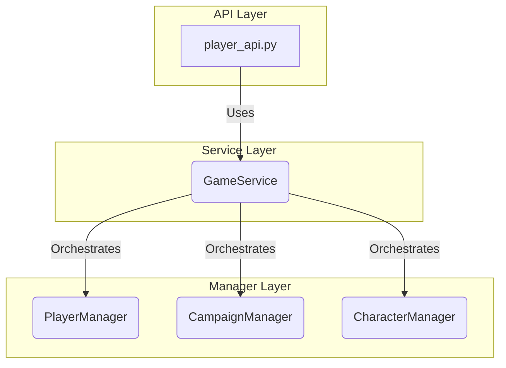

# Refactoring Plan: Decomposing PlayerManager

## 1. Executive Summary

This document outlines the strategic plan to refactor the backend components, primarily focusing on decomposing the `PlayerManager` to improve modularity, reduce coupling, and enhance long-term maintainability. The core of this initiative is to introduce a new `GameService` that will orchestrate complex, cross-domain operations, while refining the existing managers to adhere more closely to the Single Responsibility Principle.

## 2. The Problem: Overloaded PlayerManager

The `PlayerManager` has evolved into a "god object" that handles responsibilities spanning multiple domains:

- **Player Management:** Creating and retrieving players.
- **Campaign Management:** Finding and validating campaigns.
- **Character Management:** Finding and creating characters.
- **Business Logic:** Complex orchestration for joining campaigns.

This consolidation of responsibilities leads to several issues:

- **High Coupling:** The `PlayerManager` is tightly coupled to the `Campaign` and `Character` models and their respective database logic.
- **Poor Testability:** Unit testing the `PlayerManager` is complex due to its many dependencies and responsibilities.
- **Low Cohesion:** The class has low cohesion, as its methods are not all related to a single, well-defined purpose.
- **Difficult Maintenance:** Changes to campaign or character logic often require modifications to the `PlayerManager`, increasing the risk of introducing bugs.

## 3. The Solution: Decompose and Orchestrate

We will refactor the system by introducing a new `GameService` to orchestrate the `join_campaign` workflow and by delegating domain-specific logic back to the appropriate managers.

### New Architecture Overview

### Component Responsibilities

- **`GameService` (New):**
  - Orchestrates the `join_campaign` process.
  - Does **not** directly interact with the database.
  - Depends on `PlayerManager`, `CampaignManager`, and `CharacterManager` to perform its tasks.

- **`PlayerManager` (Refactored):**
  - Manages core player operations: `create_player`, `get_player`.
  - No longer contains logic related to campaigns or characters.

- **`CampaignManager` (Enhanced):**
  - Adds a new method: `add_player_to_campaign(campaign, player, character)`.
  - Continues to manage core campaign operations.

- **`CharacterManager` (Enhanced):**
  - Adds a new method: `find_or_create_character(player_id, character_name, character_url)`.
  - Continues to manage core character operations.

## 4. Implementation Steps

This refactoring will be executed in the following steps, as outlined in the project's TODO list:

1.  **Implement `GameService`:** Create the new `GameService` class with a `join_campaign` method that orchestrates the process.
2.  **Refactor `PlayerManager`:** Remove the `join_campaign`, `remove_campaign`, and `end_campaign` methods, and strip it down to its core responsibilities.
3.  **Enhance `CampaignManager` and `CharacterManager`:** Add the new methods as described above.
4.  **Update API Layer:** Modify `player_api.py` to use the `GameService`.
5.  **Refactor Unit Tests:** Update existing tests and create new ones for the `GameService`.
6.  **Update Documentation:** Ensure the architecture documents reflect these changes.

By following this plan, we will create a more robust, maintainable, and scalable backend architecture.