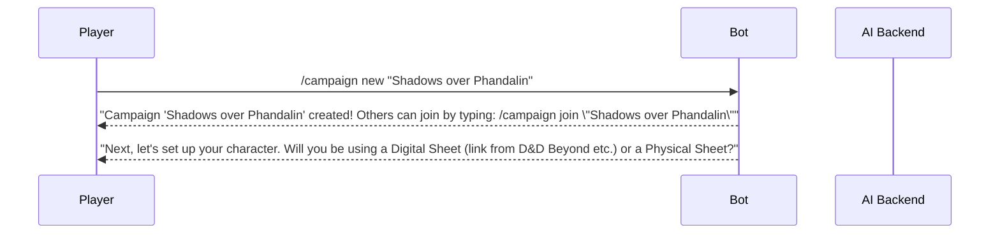
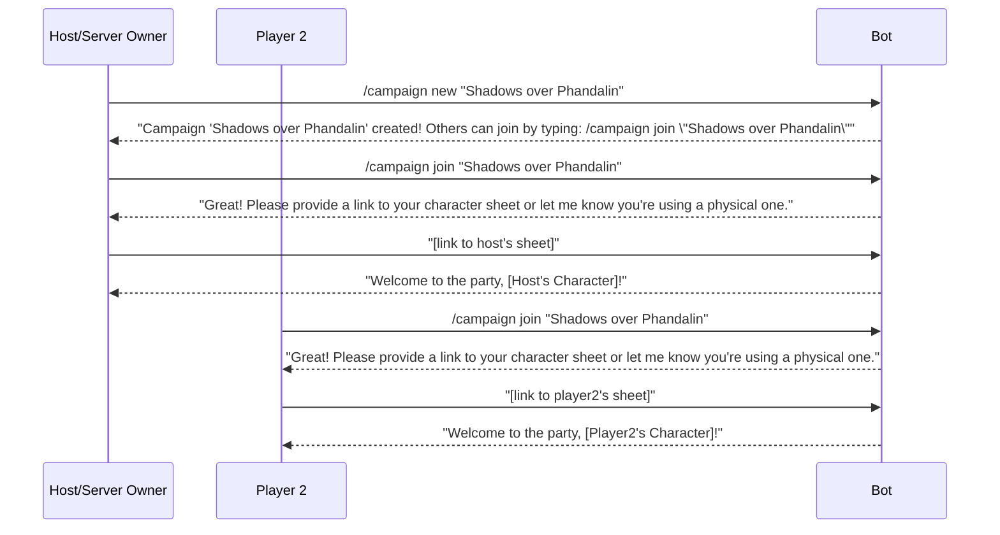

# AI D&D DM UI/UX Specification

## Introduction

This document defines the user experience goals, information architecture, user flows, and interaction design specifications for the AI D&D DM's user interface. It serves as the foundation for the interaction design and frontend development, ensuring a cohesive and user-centered experience.

### Overall UX Goals & Principles

#### Target User Personas
The primary user personas are derived from the Project Brief and PRD:
* **The "Hobbyist & Contributor":** A tech-savvy user who values control, customization, and is willing to engage with technical setup (like the BYOK model) for a powerful, free product.
* **The "Convenience Player":** A user who values ease-of-use, a polished experience, and is willing to pay to avoid logistical friction. While the MVP focuses on the Hobbyist, the UX must be simple enough not to alienate this future user.

#### Usability Goals
* **Effortless Onboarding:** A new server owner should be able to set up the bot and start a game in under 15 minutes.
* **Conversational Fluency:** Interactions with the AI should feel natural and conversational, not like rigid, command-line instructions.
* **Immersive Experience:** The interface (the bot's text and voice) must support the narrative and fade into the background, allowing the player to be fully immersed in the story.

#### Design Principles
1.  **Clarity Above All:** The bot's responses, commands, and options must be clear, concise, and unambiguous to prevent player confusion.
2.  **Immersive, Not Intrusive:** The "UI" is the story. All features should serve to enhance the narrative, not interrupt it with complex mechanics.
3.  **Player Agency First:** The interface must empower players to feel in complete control of their characters and their choices, fostering a sense of true TTRPG freedom.
4.  **Consistency is Key:** The way the bot handles commands, presents information, and roleplays NPCs should be consistent and predictable, building trust with the user.

### Change Log

| Date       | Version | Description                               | Author           |
| :---       | :---    | :---                                      | :---             |
| 2025-07-25 | 1.0     | Initial draft of all sections of the spec | Sally, UX Expert |

## Information Architecture (IA)

This architecture is designed around two distinct user states: a **Command State** for out-of-character management and a **Role-playing State** for in-character immersion.

### Command & State Inventory

```mermaid
graph TD
    A[User] --> B{Interaction State?};
    B --> C[Command State];
    B --> D[Role-playing State];

    subgraph C [Command State (Out-of-Character)]
        direction LR
        C1[/server-setup]
        C2[/server-setkey]
        C3[/help & /cost]
        C4[/campaign new]
        C5[/campaign continue]
        C6[/campaign end (Autosaves)]
    end

    subgraph D [Role-playing State (In-Character)]
        direction LR
        D1[Player Action (Text/Voice)] --> D2[AI Response & Autosave]
        D3[Take Long Rest (Clean Save Point)] --> D2
        D2 --> D1
    end
````

### Interaction Flow

  * **Primary Navigation:** Users interact with the bot using slash commands when in the **Command State**. The `/help` command is the primary discovery tool for these functions.
  * **Entering Role-playing State:** Using `/campaign new` or `/campaign continue` transitions the user into the immersive, **Role-playing State**.
  * **In-Character Interaction:** In this state, users interact naturally via text or voice. The system **autosaves progress** continuously. Explicit commands are not needed for gameplay.
  * **Exiting Role-playing State:** The session ends and returns to the Command State when the party takes a long rest, a natural story conclusion is reached, or a user issues a `/campaign end` command.

## User Flows

### Flow: Managing a Campaign Session

**User Goal:** To be able to start, play, take a break, and seamlessly resume a campaign in an immersive way.
**Entry Points:** `/campaign new` or `/campaign continue` commands.
**Success Criteria:** The user can end and resume a session without losing any progress and without feeling like their immersion was broken by technical commands.

#### Flow Diagram

```mermaid
sequenceDiagram
    participant Player
    participant Bot
    participant AI_Backend as AI Backend

    Player->>Bot: /campaign continue
    Bot->>AI_Backend: Load last clean save point
    AI_Backend-->>Bot: Narrative: "Welcome back! You are rested..."
    Bot-->>Player: Narrative: "Welcome back! You are rested..."

    loop Gameplay Loop
        Player->>Bot: "I attack the dragon!" (Action)
        Bot->>AI_Backend: Process Action + Autosave
        AI_Backend-->>Bot: Narrative Response
        Bot-->>Player: "You swing your sword..."
    end

    Player->>Bot: "We make camp for the night." (Triggers Clean Save)
    Bot->>AI_Backend: Initiate Clean Save Point
    AI_Backend-->>Bot: Narrative + Prompt: "You set up camp... [Progress Saved]. Do you wish to continue playing?"
    Bot-->>Player: "You set up camp... [Progress Saved]. Do you wish to continue playing?"

    alt Player wishes to stop
        Player->>Bot: "Let's end for now."
        Bot-->>Player: "Understood. Your adventure awaits your return! (Type /campaign continue to resume)"
        Note over Bot: Bot returns to Command State
    else Player wishes to continue
        Player->>Bot: "Yes, let's keep going."
        Bot->>AI_Backend: Continue narrative
        AI_Backend-->>Bot: New Narrative Prompt
        Bot-->>Player: New Narrative Prompt
    end
```

**Edge Cases & Error Handling:**

  * If the user is disconnected unexpectedly, the system will rely on the last **Autosave**. Upon using `/campaign continue`, the user will be restored to their last known action.

### Flow: New Campaign & Character Creation

**User Goal:** To easily start a brand new adventure and bring my D\&D character into the game world.
**Entry Points:** The `/campaign new` command.
**Success Criteria:** A new user can successfully start a campaign and register their character with the bot in a single, guided interaction, ready for gameplay.

#### Flow Diagram



#### Notes:

  * The character setup process will depend on the "Character Sheet Mode" chosen for the campaign (see Dice Rolling & Interaction Modes section).

### Flow: Forming a Campaign Party

**User Goal:** As a server owner, to create a campaign, and as a player, to easily join it with my character using a memorable name.
**Entry Points:** `/campaign new [name]`, `/campaign join [name]`
**Success Criteria:** A group of 2-5 players can successfully form a party and be ready to start a campaign together.

#### Flow Diagram



## Dice Rolling & Interaction Modes

To provide maximum flexibility, the bot will support two foundational **"Character Sheet Modes."** The host will select the mode for the campaign during `/campaign new`. This choice determines which Player Roll Modes are available.

### Foundational Setting: Character Sheet Mode

1.  **Digital Sheet Mode (Default):** Players provide a link to a public character sheet (e.g., D\&D Beyond). In this mode, the bot **knows** the character's stats, modifiers, and abilities. This enables the most powerful and automated features.
2.  **Physical Sheet Mode:** Players use their own physical or private digital sheets. The bot has **no knowledge** of the character's stats. It must trust the player to provide all information.

### DM Roll Visibility

A separate campaign-wide setting will determine if the DM's rolls are public or hidden, simulating the use of a "DM screen."

### Available Player Roll Modes (Based on Sheet Mode)

#### If in "Digital Sheet Mode":

*(The bot knows all the character's modifiers)*

  * **1. Manual (Raw d20 Roll):** The player wants to use physical dice but doesn't want to do math.
  * **2. Manual (Digital Dice):** The player wants to trigger a roll but have the bot do the math.
  * **3. Automatic (Transparent Rolls):** The bot handles everything and shows its work.
  * **4. Automatic (Hidden Rolls):** The most immersive, narrative-only mode.

#### If in "Physical Sheet Mode":

*(The bot knows nothing and must trust the player completely)*

  * **1. Manual (Player-Calculated Total):** The player does all the math and states the final total.
  * **2. Manual (Digital Dice Roller):** The player wants to use the bot as a simple calculator and must provide the full formula (e.g., `/roll 1d20+5`).

## Wireframes & Mockups (Message Design)

For the Discord bot MVP, "wireframes" refer to the design and layout of the bot's key messages and embedded responses. The goal is to present information clearly and attractively within Discord's markdown and embed limitations.

### Dynamic Display Principle: Hide Empty Fields

To maintain a clean and uncluttered interface, fields that are empty, set to zero, or not applicable to the character **should be hidden from view**.

### Key Message Layout: Character Sheet (`/sheet`)

The `/sheet` command will display a comprehensive, multi-page embed. The player will navigate between up to six distinct pages using a row of buttons. Pages or sections that are not relevant (e.g., 'Spellcasting' for a non-spellcaster) will be hidden.
*(This section contains the detailed 6-page character sheet layout defined previously)*

## Component Library / Design System (Minimal Style Guide)

### Design System Approach

Our approach for the MVP is to define a small set of custom formatting rules to ensure a unique brand identity while remaining lightweight.

### Core Formatting Rules & Components

  * **Narrative Titles & Scene Changes:** Use Header 3 Markdown (`###`).
  * **Spoken Dialogue:** Use Block Quote Markdown (`>`).
  * **Proper Nouns & Emphasis:** Use *italics*.
  * **Game Mechanics & Dice Rolls:** Use Inline Code Markdown (`` ` ``).
  * **Out-of-Character System Messages:** Use standard, unformatted text.

### Iconography (Bot Avatar)

The avatar will be a **hooded owl**. The style should be a monochromatic ink drawing of a mysterious, hooded owl figure hunched over a glowing tome.

## Accessibility Requirements

### Compliance Target

  * **Standard:** Web Content Accessibility Guidelines (WCAG) 2.1 Level AA.

### Key Requirements

  * **Visual:** All text must meet contrast ratios; generated images must have alt text.
  * **Interaction:** All interactions must be keyboard accessible and screen reader friendly.
  * **Content:** All core functionality must be accessible via text commands.

## Responsiveness Strategy

### Adaptation Patterns

  * **Layouts:** All bot messages and embeds will use a simple, single-column layout to ensure readability on all devices.
  * **Content Priority:** The most critical information in any message will be placed at the top.
  * **Interaction:** Button rows will be limited to five to prevent awkward wrapping on mobile.

## Animation & Micro-interactions

### Key Animations & Interactions

  * **The "DM is Thinking..." Indicator:** The bot will display Discord's "typing..." indicator before sending long narrative responses.
  * **Dice Roll Animation:** The bot may use an animated dice emoji or GIF for digital rolls.
  * **Critical Hit / Fumble Emphasis:** The bot will use relevant emojis (e.g., 💥, 💀) to add emphasis.

## Performance Considerations

### Performance Goals

  * **Voice Interaction Latency:** Average roundtrip of **under 4 seconds**.
  * **Text Interaction Latency:** Target response time of **under 3 seconds**.

### Design Strategies

Strategies include optimized AI prompts, efficient backend processing, and asynchronous operations for non-critical tasks.