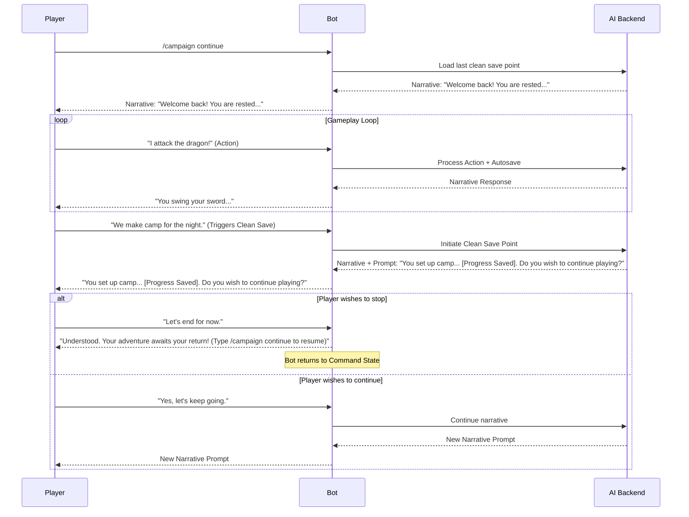
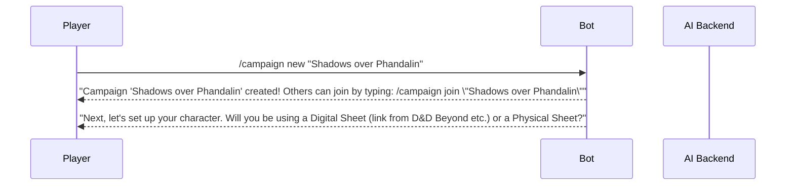
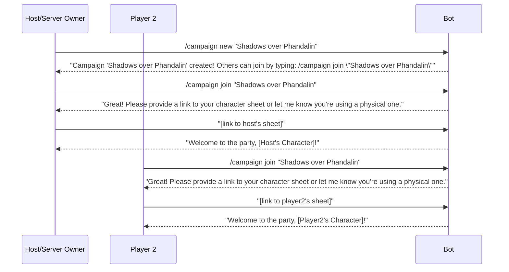

# User Flows

### Flow: Managing a Campaign Session

**User Goal:** To be able to start, play, take a break, and seamlessly resume a campaign in an immersive way.
**Entry Points:** `/campaign new` or `/campaign continue` commands.
**Success Criteria:** The user can end and resume a session without losing any progress and without feeling like their immersion was broken by technical commands.

#### Flow Diagram

**Edge Cases & Error Handling:**

  * If the user is disconnected unexpectedly, the system will rely on the last **Autosave**. Upon using `/campaign continue`, the user will be restored to their last known action.

### Flow: New Campaign & Character Creation

**User Goal:** To easily start a brand new adventure and bring my D\&D character into the game world.
**Entry Points:** The `/campaign new` command.
**Success Criteria:** A new user can successfully start a campaign and register their character with the bot in a single, guided interaction, ready for gameplay.

#### Flow Diagram

#### Notes:

  * The character setup process will depend on the "Character Sheet Mode" chosen for the campaign (see Dice Rolling & Interaction Modes section).

### Flow: Forming a Campaign Party

**User Goal:** As a server owner, to create a campaign, and as a player, to easily join it with my character using a memorable name.
**Entry Points:** `/campaign new [name]`, `/campaign join [name]`
**Success Criteria:** A group of 2-5 players can successfully form a party and be ready to start a campaign together.

#### Flow Diagram


